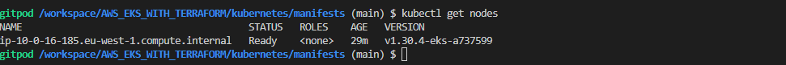
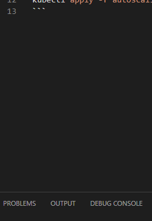
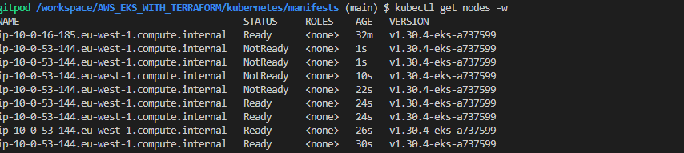

# Testing Cluster Autoscaling

### First get the number of nodes
```bash
kubectl get  nodes
```



### Deploy the application
```bash
kubectl apply -f autoscaling-example/
```


### Check the number of nodes now
```bash
kubectl get  nodes -w 
```
