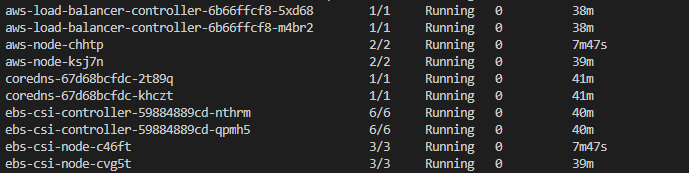
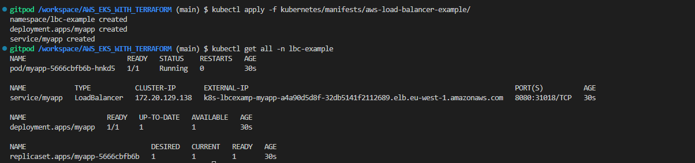
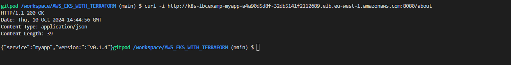

# Testing aws load balancer controller

### Check if the aws-load-balancer-controller pod was deployed
```bash
kubectl get  pod -n kube-system
```


### Deploy the app and check if the load balancer aws creates



### check if the load balancer will redirect the traffic
