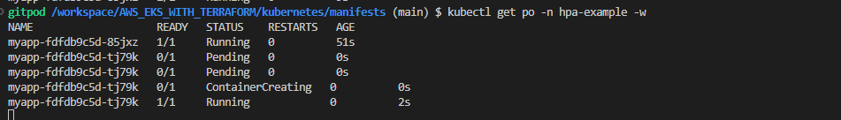
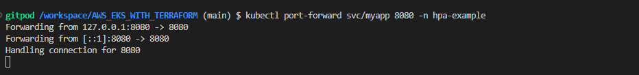
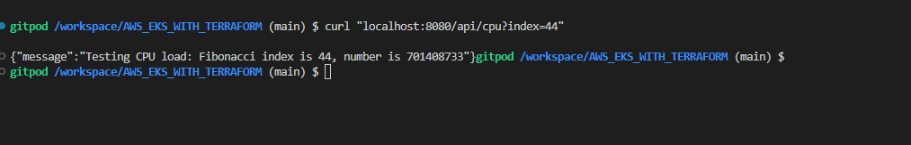

# Test the Horizontal Pod Autoscaling

### First deploy the application
```bash
kubectl apply -f hpa-example/
```

### Port-forwarding
```bash
kubectl port-forward svc/myapp 8080 -n hpa-example
```


### Generate Traffic
```bash
curl "localhost:8080/api/cpu?index=44"
```
